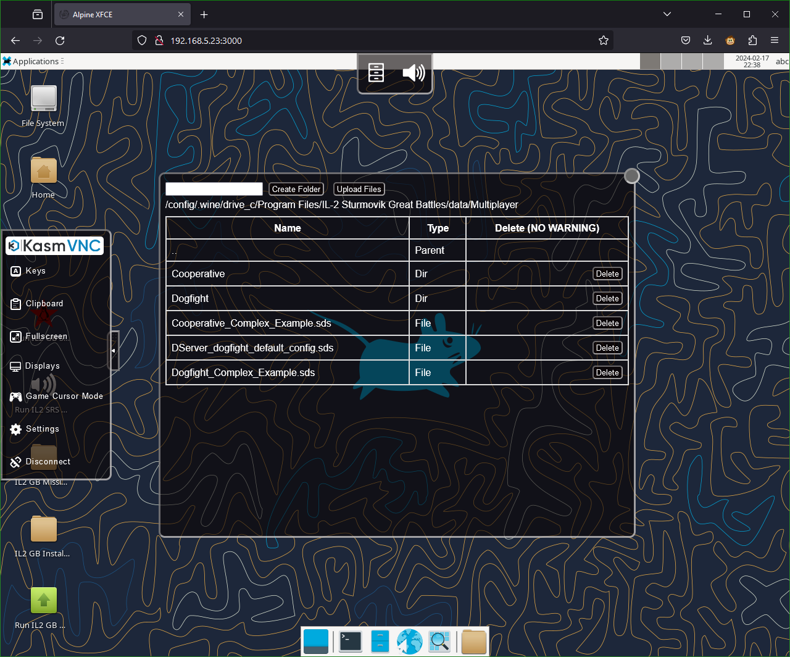

# IL2-GB-Dedicated-Server-Docker
<!--

-->

## **tl;dr?**

**Q:** What does this Docker image do? 

**A:** It lets you run the IL2 GB Dedicated server on Linux (in a Docker container) with web based access to a GUI running the xfce desktop environment.

## Longer summary

This repository borrows from the work of [DCS-World-Dedicated-Server-Docker](https://github.com/Aterfax/DCS-World-Dedicated-Server-Docker) and provides a Docker image created in order to run the IL2 Great Battles Dedicated server using WINE (relatively painlessly) and is based on the Alpine version of the [linuxserver/webtop image](https://docs.linuxserver.io/images/docker-webtop). 

Various automations and helper scripts are provided. In depth configuration and management of the server is best done via the provided WebGUI (that's mainly why this image is based on the [linuxserver/webtop image](https://docs.linuxserver.io/images/docker-webtop) image.)

## Table of Contents

- [Quickstart](#Quickstart)
- [Configuration](#Configuration)
- [FAQ](#FAQ)
- [Troubleshooting](#Troubleshooting)
- [Contributing](#Contributing)
- [License](#License)

## Quickstart

### Prerequisites

* You are running a platform which supports Docker and you have Docker installed on your system. i.e. a Linux machine or cloud VM. You can download it from [here](https://www.docker.com/get-started).
* Ensure you have enough storage space to store the IL2 GB server (~60GB).
* You understand how and when to open ports and setup port forwarding to your running IL2 GB server through your router, firewall and machine where this is required.
* You are already familiar with configuring and running an IL2 GB Dedicated server (from Windows) as this project does not go into depth about how to do so.
* If your server is on the same network as one or more players, your network must allow virtual mac addressing (multiple macs on the same nic) as an alternative interface is required to work around an IL2 server quirk (explained below). This workaround ONLY works on Linux hosts, but may be unnecessary on Windows/Mac (Untested).

### Using the DockerHub provided image

* First familiarise yourself with the [linuxserver/webtop image](https://docs.linuxserver.io/images/docker-webtop) image and consult their documentation on how to make use of the provided web accessible GUI functionality. Particularly how to secure access to the running container and adding SSL certificates where needed.
* Take a look at the [docker-compose/Dedicated-Server](docker-compose/Dedicated-Server/) folder and ``docker-compose.yml`` file. Make amendments as needed, taking care with the volume binds ensuring the chosen location has sufficient storage.
  * **Note:** If your server is located on the same network as your players (ex. your home network), IL2 DServer will not allow LAN players to connect through the docker bridge, while users outside your network will be able to connect normally. To work around this, edit ``docker-compose.yml`` and uncomment the two sections starting with ``il2-0-net`` and modify the networking lines to match your network exactly. ipv4_address should be set to an unused IP in your network (ideally outside of your DHCP range). driver_opts:parent should be set to the name of your host network interface (commonly eth0 or eno1). subnet and gateway should be set according to your network. The Web GUI, etc will still be available at the IP of your docker host by default, but the IL2 DServer will instead point to this new IP address once SDS files are appropriately edited and router port forwards are updated to point to this new IP.
* Copy and amend ``.env.example `` to ``.env`` as required. If you want to validate the correct settings are applied you can run ``docker compose config`` to display what Docker will use.
* To start the container, navigate to the [docker-compose/Dedicated-Server](docker-compose/Dedicated-Server/) directory and then run the command ``docker compose up -d && docker logs -f il2-gb-dedicated-server``.
* On first start, the container will download and install the WINE prerequisites and (if ``IL2GBAUTOINSTALL=1``,) IL2 GB server executable then begin installation of the IL2 GB Server. You can open the WebGUI at the default port ``3000`` or your chosen port to observe this process.
* If you wish to manually request installation, you can run the installer with the ``Run First IL2 GB Install`` desktop shortcut or by opening a terminal and running the command:
        
        /app/il2_gb_server/wine-dedicated-il2-gb-automated-installer/il2-gb-dedicated-server-automatic-installer.sh 

  * **Note:** Even if you request a manual installation, if you have set the environment variable ``IL2GBAUTOINSTALL=1`` in your docker compose ``.env`` file, the installer will be fully automated from this point. If you have not elected to set the above, the installer will first install the base server and then prompt you to interactively choose the terrain modules to install. 
* It is recommended to disconnect / close the VNC window while downloading the game to prevent bandwidth throttling. The same is true while the server is running.
* When installation or update checks complete, the launcher will close automatically.
* Post server installation, various shortcuts will now also have been added to the desktop for opening the server WebGUI or running and updating the IL2 GB server and opening IL2 GB related directories.
* Once you have configured your IL2 GB Server installation to your taste, you can set it to auto start by defining the environment variable ``AUTOSTART=1`` and providing a valid DServer SDS file name (with corresponding file placed in the IL2 GB installation's data/Multiplayer directory) in the variable ``AUTOSTARTSDS``.

### Using a self built image

* Navigate to the ``docker`` subdirectory and run the command ``docker build -t $USER/il2-gb-dedicated-server .``
* Take a note of the final line of this command's output e.g. :

        => => naming to docker.io/myusername/il2-gb-dedicated-server

* Amend the [docker-compose/Dedicated-Server/docker-compose.yml](docker-compose/Dedicated-Server/docker-compose.yml) image line to: 
  
        image: myusername/il2-gb-dedicated-server

* You can now follow the instructions as per the [Using the DockerHub provided image](#Using-the-DockerHub-provided-image) section.
<!-- 
## Example installation video

**Hint:** Click the image to go to Youtube.
-->

## Configuration

### Common post installation configuration actions

After installation is complete, you can configure your server as you would do so typically, editing configuration or adding missions etc... at to the following path (which you can also open from the ``IL2 GB Install Dir`` desktop shortcut):

    "/config/.wine/drive_c/Program Files/IL-2 Sturmovik Great Battles/"

**Hint:** you can set the IL2 GB server to auto start by defining the environment variable ``AUTOSTART=1`` and providing a valid DServer SDS file name in the variable ``AUTOSTARTSDS``.

**Hint:** upload of files to the folder above can be done using the KASM menu's file manager as shown below.

**Hint:** Your SDS files MUST point to the ethernet IP address within the docker image to bind correctly. This can be obtained by opening a terminal and typing ``ip addr | grep eth``. It is also printed in the log after the Wine Prerequisits are fulfilled / verified.

### Table of available container environment variables

The following environment variables can be configured to customize the behavior of the Docker container:

| Variable Name      | Default Docker Compose Value | Valid Values           | Description                                                                                                           |
|--------------------|------------------------------|------------------------|-----------------------------------------------------------------------------------------------------------------------|
| VNCPASSWORD        | `123123123`                  | Any string             | Set to the desired VNC password for accessing the containerized environment (e.g. `123123123`).                    |
| PUID               | `1000`                       | Numeric value          | Specifies the user ID for the container (e.g. `1000`).                                                               |
| PGID               | `1000`                       | Numeric value          | Specifies the group ID for the container (e.g. `1000`).                                                              |
| TZ                 | `Etc/UTC`                    | Timezone string        | Sets the timezone for the container (e.g., `Etc/UTC`).                                                                |
| IL2GBAUTOINSTALL     | `1`                          | `1` or `0`              | Controls automatic installation of the IL2 GB server. Set to `1` for automatic installation, and `0` to disable auto-installation. |
| FORCEREINSTALL     | `0`                          | `1` or `0`              | Controls whether the installer will forcefully remove existing installations during (re)installation of the IL2 GB server. Set to `1` for forceful reinstall, and `0` to disable forceful reinstall. |
| AUTOSTART          | `0`                          | `1` or `0`              | Controls whether the IL2 GB Server will automatically start. Set to `1` for automatic startup, and `0` to disable automatic startup. |
| AUTOSTARTSDS       | ""                           | SDS filename string    | Specifies which SDS file to auto-load from the data/Multiplayer directory during autostart. |
| SRSAUTOSTART       | 0                            | `1` or `0`             | Controls whether the docker container will attempt to automatically start the IL2 SRS server when AUTOSTART is also set. |
| TIMEOUT            | `60`                         | Numeric value (whole number) | Specifies the interval in seconds between various "liveness" checks (e.g. `60` seconds).                               |

Further valid environment variables for the image this project is built on can be found at the [linuxserver/webtop image](https://docs.linuxserver.io/images/docker-webtop) documentation page.

## FAQ

### Which user am I within the container?

As with most linuxserver.io images, in this container you will run things as the ``abc`` user. Note that the ``abc`` user's UID and GID will be those you specified within the ``docker-compose.yml`` file.

### How do I change the ports or pass through more ports from the container?

To change the ports passed through or add more, you need to edit the ports section in the ``docker-compose.yml`` file. The ports section defines the mapping between the ports on the host machine and the ports inside the container.

The syntax for the ports section is:

        ports:
        - <host_port>:<container_port>

Once you have edited the ports section, you need to rebuild and restart the containers using the ``docker-compose up -d`` command.

Keep in mind when changing the port or passing through new ports:

- If you are changing the port for the server you also need to update the firewall rules on your host machine / firewalls to allow traffic on the changed / new port as well as amending any port forwarding rules as needed.

- Changing the ports for the Docker container will not change the ports any running IL2 GB Server is using! You need to also change the IL2 GB Server configuration and match the passed through ports if you use ports not already specified in the ``docker-compose.yml``.

- If using the macvlan driver, all ports will be exposed on that interface, take care!

### "Failed to fdwalk: Operation not permitted" errors

Setting seccomp to unconfined with security_opt is necessary if you encounter ``Failed to execute child process "bash": Failed to fdwalk: Operation not permitted`` errors.

The example ``docker-compose.yml`` files include a commented out section to to this which you can uncomment. See also: https://docs.linuxserver.io/images/docker-webtop/#application-setup

## Troubleshooting

If you encounter issues, check the [Troubleshooting section](TROUBLESHOOTING.md)  for solutions to common problems.

If this section is lacking steps to resolve your issue please take a look in the Github discussions to see if someone else has already resolved your issue or 
please start a thread.

If you have a problem or feature request and you know this related directly to the code implemented by this repo please file an issue detailing the nature of the problem or feature and any steps for implementation within a pull request.

## Contributing

If you'd like to contribute to this project, follow these steps:

* Fork the repository.
* Create a new branch for your feature: git checkout -b feature-name.
* Make your changes and commit them e.g. : git commit -m "Add feature".
* Push to the branch: git push origin feature-name.
* Create a pull request explaining your changes.

## License

This project is licensed under the [GNU General Public License v3 (GPL-3)](https://www.tldrlegal.com/license/gnu-general-public-license-v3-gpl-3).

In short: You may copy, distribute and modify the software as long as you track changes/dates in source files. Any modifications to or software including (via compiler) GPL-licensed code must also be made available under the GPL along with build & install instructions.
